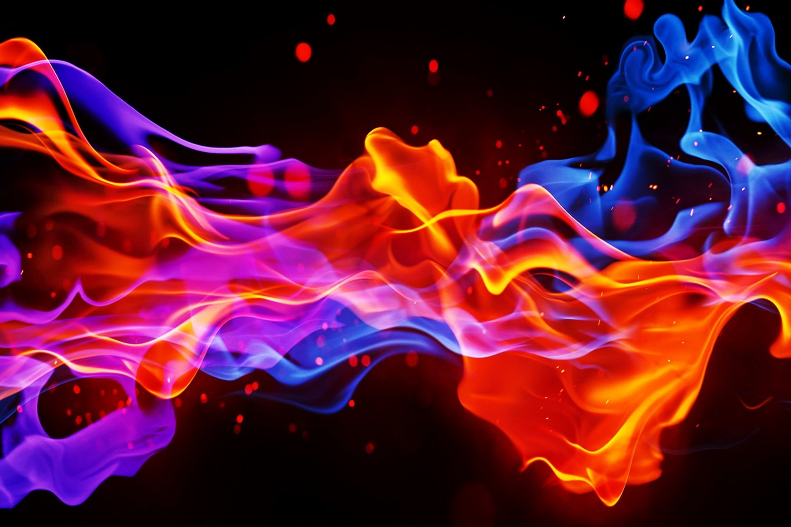
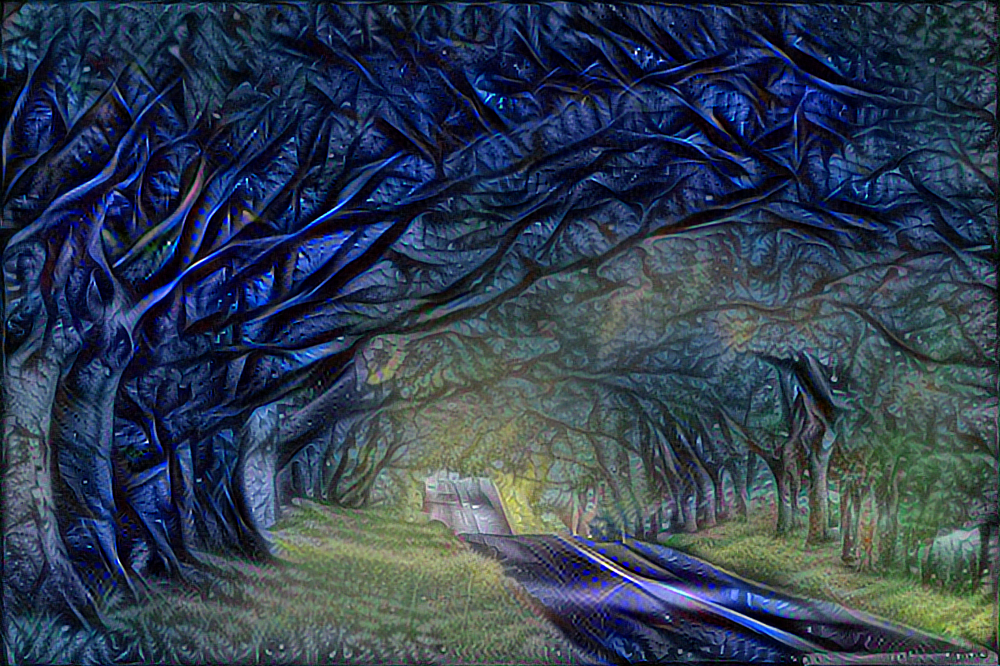

# HDStyleTransfert

This repo is a personal project to perform style transfer between
images. The goal was to create HD stylized images.
> The images size can be at least 1024 x 1024 pixels.

As you see in the results I successfully created acceptable stylized HD
images using the GPU of
[Google Colab](https://colab.research.google.com/). :tada:

## Style Transfert

### Results

Here are some results of my project:

| Content Image | Style Image | Result Image |
| :---: | :---: | :---: |
| |  | |
|  |  | |
| |  |  |

### Google colab

The file `style_transfert.ipynb` will perform the style transfert
algorithm for a combination of given images and parameters.

The steps for the setup are explained in the file.


### Script

The script `style_transfert.py` will generate one set of stylized images
for one combination of content/style images and parameters

```cmd
python style_transfert.py
```

The content and style images must be in a `content` and `style` folders
or `content.zip` and `style.zip` files at the root of the project

The parameters can be changed by creating and editing the files:

- `style_transfert_options.json`
- `style_transfert_parameters.json`
- `style_transfert_parameters_list.json`


It will create a `results` folder with the stylized images in it.

To apply the style transfert on several images, run the command

```cmd
python style_transfert.py
```

 as many times as you need
